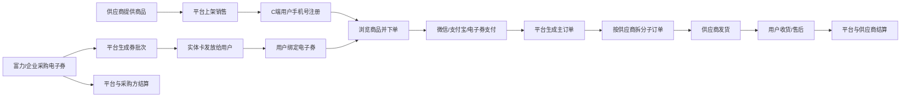
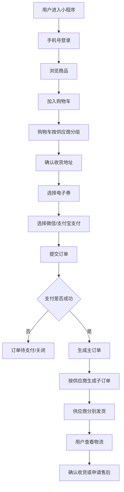
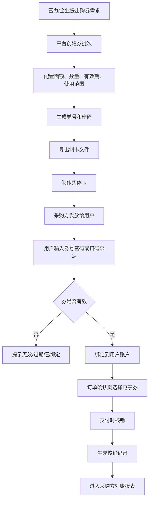
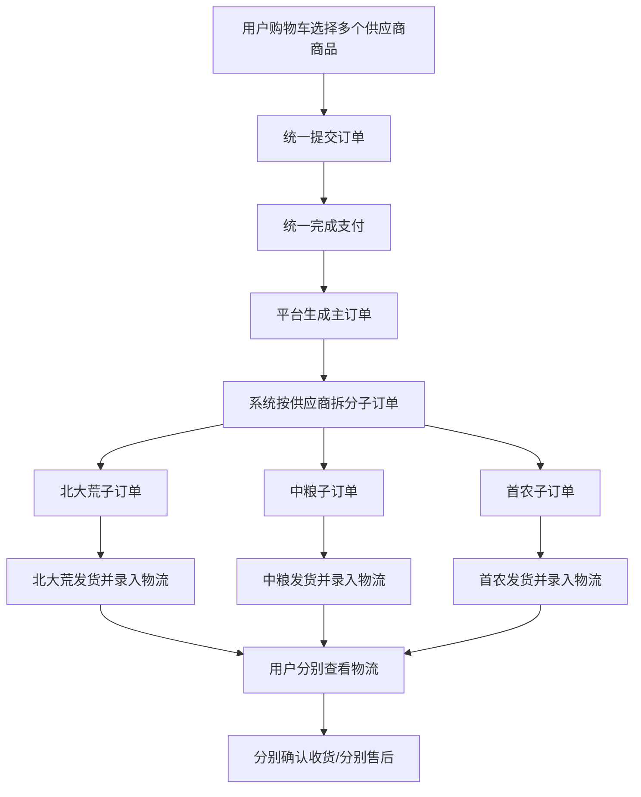
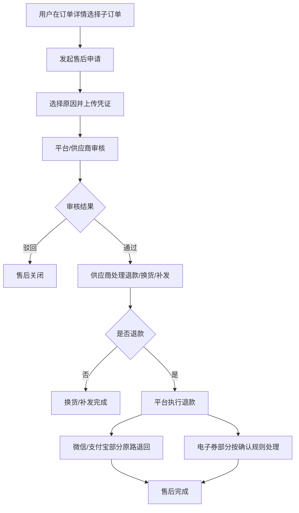
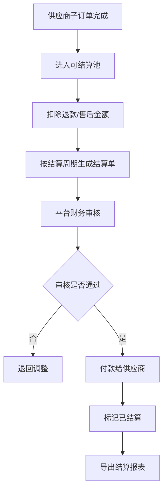
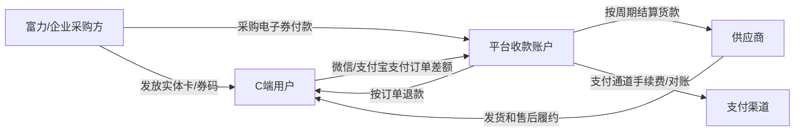
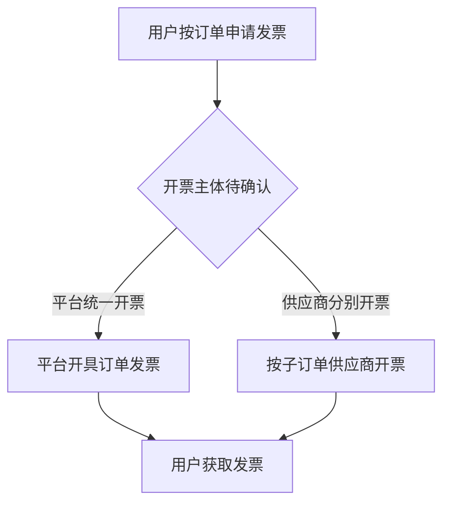

# 央企农业食材平台业务流程图

## 1. 总体业务闭环

## 2. 用户下单流程

## 3. 电子券采购、制卡、绑定、核销流程

## 4. 多供应商拆单履约流程

## 5. 售后退款流程

## 6. 供应商结算流程

## 7. 资金流关系

## 8. 发票流关系

## 9. 需甲方确认的流程节点

- 电子券是否可以和微信/支付宝组合支付。
- 电子券是否找零或保留余额。
- 多张电子券是否可叠加。
- 退款时电子券是否恢复。
- 平台和供应商谁拥有最终退款审批权。
- 发票主体由平台还是供应商承担。
- 供应商结算周期和扣减规则。

